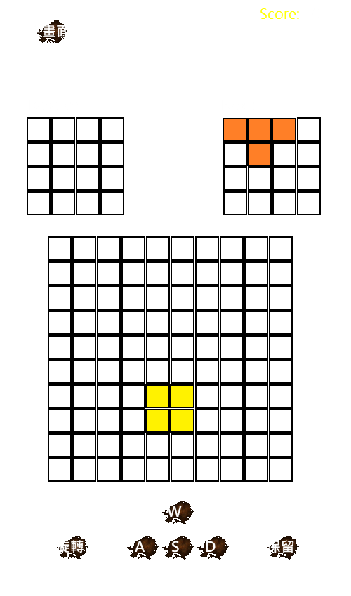

# Tetris2048

## 遊戲介紹

Tetris2048 是使用 Solar2D（Lua）開發的益智遊戲，結合俄羅斯方塊、方向滑動與行列消除。玩家每回合先將盤面方塊往指定方向移動，再由系統放入下一個方塊；透過旋轉、保留與策略移動填滿整列或整行來得分，並挑戰本機及全球排行榜。

[](https://github.com/xixa3333/Tetris2048/releases/latest)

## 遊戲畫面



## 下載

請從 [GitHub Releases](https://github.com/xixa3333/Tetris2048/releases/latest) 下載最新版：

- Android：`Tetris2048-Android-v2.3.7.apk`
- Windows：`Tetris2048-Windows-v2.3.7.zip`，解壓縮後執行 `Tetris2048.exe`

APK、EXE 等建置產物只放在 Releases，不提交到原始碼分支。

## 遊戲規則

- 遊戲使用 10×10 棋盤，由 T、O、Z、S、I 與藍色 3×3 L 六種方塊組成。
- 每次選擇移動方向後，同色且上下左右相連的方塊會保持形狀，沿該方向滑到底或被其他方塊擋住。
- 移動與消除判定完成後，系統會依照目前預覽的方塊與旋轉方向，完整搜尋棋盤並隨機選擇一個合法位置放入。
- 可預先旋轉下一個方塊，也可保留或與保留區的方塊交換。
- 當下一個方塊以目前旋轉方向搜尋所有座標後仍沒有合法位置時，遊戲結束；系統不會自行改變玩家選定的旋轉方向。

## 得分機制

- 填滿任一條完整橫列或直行就會消除，每條得 10 分。
- 同一次同時完成多條橫列或直行時，每條都分別計算 10 分。
- 每回合會在新方塊放置前、放置後各進行一次消除與得分判定。
- 0 分對局不會寫入本機排行榜。

## 遊玩方式

| 動作 | 鍵盤／手機 |
| --- | --- |
| 上、下、左、右移動 | `W`、`S`、`A`、`D`／四方向滑動 |
| 旋轉下一個方塊 | `R`／旋轉按鈕 |
| 保留／交換方塊 | `Space`／保留按鈕 |

遊戲中可按「主畫面」保存當前分數並返回封面。Game Over 後可直接重新開始，或回到主畫面。

## 排行榜

- 排行榜需先使用唯一帳號 ID 登入；ID 可使用 3～20 個英文字母、數字、底線、句點或連字號，玩家也可設定 2～16 字元暱稱。
- 新帳號的 ID 建立後永久不可修改；程式會自動建立不收信、不顯示給玩家的 Firebase 內部虛擬信箱。
- 舊版電子郵件帳號登入後會建議執行一次性轉換；新 ID、暱稱及全球最高分確認搬移成功後，才清除舊排行榜紀錄。
- 本機排行榜彙整這台裝置上所有帳號的正分紀錄，並可逐筆刪除。
- 全球排行榜每個帳號只顯示一筆最高分，並在頁面上固定顯示自己的全球名次、加亮自己的紀錄列；暱稱修改後會同步更新。
- 帳號 ID 是唯一且不可修改的登入名稱，暱稱可以重複；排行榜以固定 UID 確認歸屬。
- 本機與全球排行榜都是每頁 10 名，可在底部切換上一頁與下一頁。

## 其他功能

- 全部選項使用明亮粗體文字，提高手機可讀性。
- 封面「設定」可調整背景音樂及消除音效百分比；背景音樂只在遊戲進行中播放。
- 可輸入最多 64 字元的關卡種子；相同種子會重現相同方塊與落點順序，留空則使用一般隨機。
- 全部介面使用 `letterbox` 依手機尺寸等比例縮放；設定頁與封面共用相同的 500×850 版面基準，避免巢狀座標造成元件位移。
- 封面右下角顯示目前版本；啟動時會檢查 GitHub Releases，只有發現新版才提示並提供固定的最新版本下載連結，離線或檢查失敗不影響遊玩。
- 一般 ID 不蒐集真實電子郵件，可在登入後修改密碼及暱稱；舊信箱帳號仍可使用忘記密碼信或轉換成永久 ID。
- 登入後只保存 Firebase Refresh Token，不保存明文密碼或 ID Token。
- 手機從背景恢復時會重建棋盤貼圖與輸入；若恢復失敗則回到乾淨主畫面。

## 專案結構

根目錄只保留本說明檔；其餘內容依用途分類：

```text
README.md
docs/       文件與版本資訊
firebase/   Firestore 規則與索引
src/        Solar2D 遊戲原始碼與素材
tests/      單元、整合、邊緣、白盒與架構測試
```

核心分層：

- `board.lua`、`game_logic.lua`：純遊戲規則。
- `game_controller.lua`：遊戲回合與動畫時序。
- `app_controller.lua`：封面、登入、暱稱及排行榜流程。
- `input_adapter.lua`：鍵盤與手機滑動手勢轉換。
- `settings_service.lua`、`seeded_random.lua`、`audio_service.lua`：設定保存、可重現亂數與音訊通道。
- `update_service.lua`：獨立查詢 GitHub 最新版本並比較版本號，只回傳受信任的固定下載連結。
- `account_identity.lua`、`account_migration.lua`、`auth_service.lua`、`session_store.lua`：永久 ID、舊帳號資料搬移、Firebase 認證與安全工作階段恢復。
- `profile_service.lua`、排行榜模組：Firebase／本機資料服務。
- `pagination.lua`：本機與全球排行榜共用的純分頁規則。
- `lifecycle_adapter.lua`：手機暫停、恢復與故障回復。
- `ui_renderer.lua`、`app_view.lua`：Solar2D 顯示層。
- `main.lua`：依賴組裝入口。

## 測試

```powershell
cd tests
npm install
npm test
```

測試涵蓋遊戲規則、目前旋轉方向的完整合法落點搜尋、藍色 L 方塊空白邊界、雙階段消除、旋轉放置、四方向滑動、版本更新提示、背景恢復、唯一 ID 與舊帳號遷移、密碼流程、安全工作階段、個資不落地、全球名次、排行榜最高分去重、帳號隔離、邊緣條件、白盒分支、語法及架構限制。

## 後端

- Firebase Project ID：`xixa3333-tetris2048`
- Firestore 區域：`asia-east1`
- 安全規則位於 `firebase/firestore.rules`
- 帳號 ID 的唯一性與密碼只交由 Firebase Authentication 處理；Firestore 不保存帳號 ID、電子郵件、密碼或登入憑證。

版本紀錄請見 [docs/VersionInformation.md](docs/VersionInformation.md)。
