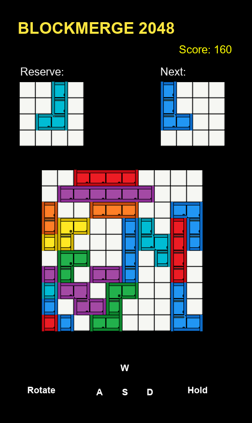

# BlockMerge 2048

BlockMerge 2048 是一款把「方塊滑動」和「2048 合併得分」混在一起的休閒益智遊戲。你要把畫面上的彩色方塊往上下左右推動，讓同色方塊排成可以消除的形狀，在棋盤被塞滿前盡量拿到更高分。

## 遊戲畫面

## 下載遊戲

請到 GitHub Releases 下載最新版：

[下載最新版 BlockMerge 2048](https://github.com/xixa3333/Tetris2048/releases/latest)

- Android：下載 APK 後安裝。
- Windows：下載 ZIP，解壓縮後執行 `BlockMerge2048.exe`。
- iPhone / iPad：目前準備透過 TestFlight 測試，尚未開放一般下載。

## 遊戲目標

你的目標很簡單：在棋盤還有空間時，盡量消除更多方塊、累積更高分。

每一回合會出現新的方塊，你可以選擇方向讓場上的方塊移動。移動、消除、新方塊放入後，遊戲會繼續檢查是否還能消除。當目前的新方塊已經找不到合法位置可以放置時，遊戲結束。

## 基本玩法

### 電腦操作

| 操作 | 按鍵 |
| --- | --- |
| 往上移動 | `W` 或方向鍵上 |
| 往左移動 | `A` 或方向鍵左 |
| 往下移動 | `S` 或方向鍵下 |
| 往右移動 | `D` 或方向鍵右 |
| 旋轉 Next 方塊 | `R` |
| 保留 / 換出 Reserve 方塊 | `Space` |

### 手機操作

- 用手指往上、下、左、右滑動，就等同於電腦的 `W / A / S / D`。
- 也可以點畫面上的按鈕旋轉、保留或回到主畫面。

## 得分與消除機制

- 同色方塊達成可消除條件時會被消除並得分。
- 一次消除越多，分數越高。
- 移動後會先檢查消除，放入新方塊後也會再檢查消除。
- 0 分不會記入排行榜。

## 兩種遊戲模式

遊戲開始後可以選擇模式：

- 模式 1：比較需要規劃，同色相連方塊會以群組方式移動。
- 模式 2：比較輕鬆，同色相鄰也會保持各自獨立，玩起來比較直覺。

兩種模式的排行榜會分開計算。

## 排行榜

排行榜分成：

- 本機排行榜：記錄這台裝置上的遊玩分數。
- 全球排行榜：登入後可上傳分數，並和其他玩家比較。

全球排行榜會顯示暱稱，但真正用來確認玩家身分的是帳號 ID。每個帳號在全球排行榜只會保留最高分，讓排名更公平。

## 設定

設定裡可以調整：

- 背景音樂
- 背景音樂音量
- 消除 / Game Over 音效音量
- 遊戲種子

遊戲種子可以讓你重複玩到同一組隨機流程。也就是說，如果兩台裝置使用同版本遊戲、同模式、同一個種子，正常情況下會拿到相同的新方塊順序，適合朋友之間挑戰同一關。

## 回報問題

如果遊戲遇到問題，或你有想加入的新玩法，可以到 GitHub 回報：

[GitHub Issues](https://github.com/xixa3333/Tetris2048/issues)

作者 GitHub：

[xixa3333](https://github.com/xixa3333)

## 關於專案

這個遊戲使用 Solar2D 製作，支援 Android 與 Windows。專案也包含自動測試，用來檢查移動、放置、消除、排行榜、登入資料安全等功能。
